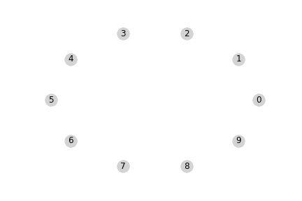
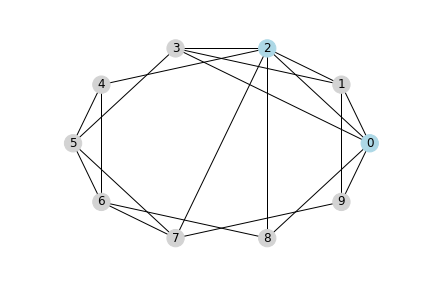

Implementation of different methods for generating simulated graphs:
* **Watts-Strogatz model**, based on this [article](https://www.nature.com/articles/30918). For estimating the small world network regime; *small world measurement* introduced in: [article](https://www.ncbi.nlm.nih.gov/pmc/articles/PMC3604768/)
* **Erdös–Rényi**: Binomial random graph introduced in this [book](https://www.cambridge.org/fr/academic/subjects/physics/statistical-physics/complex-networks-principles-methods-and-applications?format=HB&isbn=9781107103184)
* **Weighted Social Networks** (WSN) - Emergence of communities in weighted networks- [article](https://arxiv.org/abs/0708.0925#:~:text=Topology%20and%20weights%20are%20closely,they%20shape%20the%20developing%20topology.) and [article](https://journals.plos.org/plosone/article?id=10.1371/journal.pone.0133005). For a faster and more robust implementation check this [repository](https://github.com/yohm/weighted_social_network_model), by [Yohsuke Murase](https://yohm.github.io/). This [demo](https://yohm.github.io/p5js_simulations/wsn/) is also very nice :).

For visualizing large graphs I use [gephi](https://gephi.org/).

# Watts-Strogatz algorithm

# hubs

